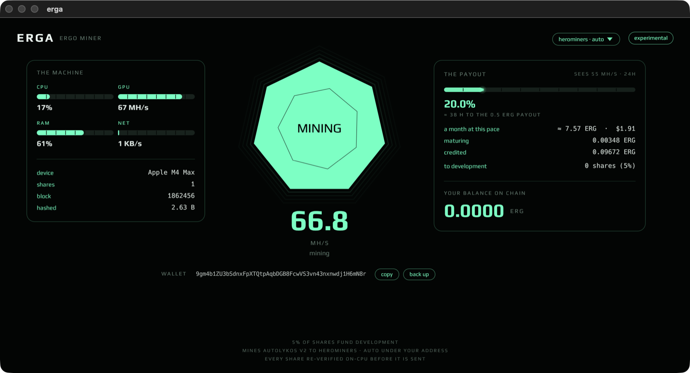

# erga

**One button. Your Mac mines ERGO.**



Open the app, press the crystal, and an Apple Silicon Mac mines Autolykos v2
to a pool under a wallet it generates for you. Live hashrate, accepted
shares, and a progress bar to your first payout — with an honest countdown
computed from live network difficulty.

Status: **working end to end.** It connects, mines, submits, gets shares
accepted, and tracks what the pool owes you. Verified against the chain,
not just against itself.

## it works — and here is how that was checked

| piece | state | verified how |
|---|---|---|
| Autolykos v2 reference (`crates/autolykos`) | done | reproduces sigma-rust's own chain vector (height 614400 → hit `0x0002fcb1…412a`) |
| GPU kernel | done | differential test: GPU hit is byte-exact to the CPU reference over 512 nonces |
| stratum client (`crates/erga-pool`) | done | live shares **accepted** by herominers and by 2miners |
| share re-verification | done | every candidate is re-hashed on the CPU reference before it is sent — nothing invalid ever leaves the machine |
| wallet (`crates/erga-wallet`) | done | ergo-lib (the reference wallet): BIP39 → `m/44'/429'/0'/0/0` → P2PK |
| balance + pool ledger | done | public explorer + the pool's per-address API |
| tests | 12 passing | `cargo test --workspace` |

## install

Download the `.dmg` from [Releases](https://github.com/cyberia-to/erga/releases),
drag `erga.app` to Applications. It is not notarized yet, so clear the
quarantine flag Gatekeeper sets on downloaded apps:

```
xattr -dr com.apple.quarantine /Applications/erga.app
```

Then open it and press the crystal. A wallet is generated on first launch —
back up the 15 words from the **back up** button; that seed *is* your wallet.

Headless, no GUI — same engine, no window:

```
erga mine                                   # your wallet, the pool you picked
erga mine ergo.herominers.com 1180 <addr>   # or say it explicitly
```

Installed as an app, the binary is inside the bundle:

```
/Applications/erga.app/Contents/MacOS/erga mine
```

## which Mac, and what to expect

### memory is the real gate

Autolykos v2 rebuilds a table of `N` 32-byte elements **every block**, and
`N` grows with chain height. Right now (height ~1.86M) that table is
**6.8 GiB**, and the process sits at ~7.1 GB steady / 8.5 GB peak — measured
with `footprint`.

| unified memory | verdict |
|---|---|
| 8 GB | **will not work** — the table alone is larger than the machine |
| 16 GB | works today, with little room to spare |
| 24–36 GB | comfortable |
| 48 GB+ | room for years of growth |

`N` rises 5% every 51,200 blocks — about every 71 days, so roughly **+28% a
year**. A 16 GB Mac that mines today will be squeezed within a year or two.
This is a property of the protocol, not of erga.

### hashrate

Autolykos v2 is memory-bandwidth-bound, so the rate tracks memory bandwidth
far more closely than GPU core count. Only the first row is measured on
hardware we own; the rest is that ratio applied, and should be read as an
estimate.

| chip | memory bandwidth | MH/s |
|---|---|---|
| **M4 Max** (40-core GPU) | 546 GB/s | **52–67 measured** |
| M1 / M2 Ultra | 800 GB/s | ~75–95 est. (two dies — may scale sub-linearly) |
| M1 / M2 / M3 Max | 400 GB/s | ~40–50 est. |
| M4 Pro | 273 GB/s | ~26–34 est. |
| M1 / M2 Pro | 200 GB/s | ~19–25 est. |
| M3 Pro | 150 GB/s | ~14–18 est. |
| M4 | 120 GB/s | ~11–15 est. |
| M1 / M2 / M3 base | 68–100 GB/s | ~7–12 est. |

Measured a number on your Mac? Open an issue — the table gets better.

### what it earns

Honestly: not much, and the app says so. At ~60 MH/s against the current
network (~600 GH/s, 3 ERG per block) that is roughly **6–8 ERG a month**,
which at today's price is a couple of dollars. The app shows this live —
`a month at this pace`, in ERG and in dollars — so you never have to guess.

The interesting number is not the dollars, it is the watts (see
[the research](#the-research-behind-it) below).

## how it works

```
erga.app  (eframe/egui — draws only)
   │  spawns, reads STAT lines from stdout
   ▼
erga-miner  (its own process — all GPU work lives here)
   │
   ├── autolykos   protocol-exact reference, chain-verified
   ├── erga-pool   stratum: subscribe · authorize · notify · submit
   └── honeycrisp  zero-copy Metal: one IOSurface-pinned table, no staging
```

The miner runs as a **separate process** on purpose. The GUI holds an OpenGL
context (eframe/glow) while the miner drives Metal through honeycrisp; the
two graphics APIs in one process proved fragile enough to abort the app.
Split, the window only draws, and if the miner ever dies the UI survives and
says so.

Other things it does because they matter more than they look:

- **keeps the Mac awake while mining** (`caffeinate` tied to the miner's pid) —
  a machine asleep at night halves your month
- **re-verifies every share on the CPU** before submitting
- **auto-reconnects** — a dropped pool or a network blip retries instead of
  ending the session
- **pool chooser** — herominers (default: 0.5 ERG payout floor, the lowest
  verified, plus an in-app ledger) with 13 regional endpoints, and 2miners
  (admitted only after a live accepted share through this client)
- **stores the seed in a 0600 file**, not the Keychain — Keychain prompts on
  every rebuild because ad-hoc signatures change

## the 5% development share

One share in every 20 is mined for the project. It is implemented as a
*separate authorized session*: the pool credits whoever authorized the
connection, so shares cannot be relabeled — erga alternates sessions, 19 for
you and 1 for development. The app shows the running count under
**to development**, so the number is never hidden.

You own the software and the choice. No rebuild needed:

```
ERGA_DONATION=off                turn it off
ERGA_DONATION=<your address>     send that 5% wherever you like
ERGA_DONATION_EVERY=50           1 share in 50 (2%) instead
```

Or edit `DONATION_ADDRESS` / `DONATION_EVERY_NTH` at the top of
[`crates/erga-miner/src/engine.rs`](crates/erga-miner/src/engine.rs).

## build from source

Apple Silicon, macOS 14+, Rust stable, and a sibling checkout of honeycrisp:

```
git clone https://github.com/cyberia-to/honeycrisp ../honeycrisp
cargo build --release
cargo test --workspace          # 12 tests
nu packaging/bundle.nu          # → packaging/dist/erga.app + the .dmg
```

The app icon is code too — `swift packaging/icon.swift` redraws it.

## the research behind it

erga began as a measurement, not a product: **does Apple's unified memory
make M-series chips competitive at a memory-hard proof of work?** The answer
flipped twice.

The integrated kernel peaked at 65–72 MH/s — 83% of the memory-bound ceiling
(~78 MH/s at the ~82 GB/s the chip actually delivers into 32-byte random
reads). At an *estimated* 50 W that was 1.31 MH/W, below an RTX 3090, and it
was written up as a negative result.

Then power was measured instead of estimated:

| regime | hashrate | chip power | MH/W |
|---|---|---|---|
| **M4 Max sustained** (60 s+, thermal equilibrium) | **32 MH/s** | **8.28 W** measured | **3.91** |
| RTX 3090, best documented OC | 281 MH/s | 171 W | 1.64 |
| RTX 4090, best documented OC | 292 MH/s | 200 W | 1.46 |
| MacMetal Miner on M4 Max (proprietary baseline) | 60.3 MH/s | ~45 W | 1.34 |

**Sustained, an M4 Max delivers 2.4× the energy efficiency of an RTX 3090**
on this workload — 6.19 W mean GPU + 2.09 W mean CPU while holding 32 MH/s.
Per machine it is ~9× slower than a 3090; the win is per watt, not per box.

Why Apple wins sustained: the workload stalls shader cores on DRAM most
cycles, so dynamic ALU power is mostly waste. Apple's power management
collapses clocks under that profile while keeping most of the throughput; a
discrete GPU cannot downclock that far independently of its memory subsystem,
so a 3090 burns near TDP even when bandwidth is the wall.

### the wall

Eight kernel variants and two diagnostics isolated the bottleneck:

```
V1  single-nonce baseline            71.8 MH/s   ← winner
V2  dual-nonce + ulong4 loads        ~52         register pressure
V3  single-nonce + ulong4 loads      ~60         compiler already vectorizes
V4  4-up batched explicit loads      ~60         compiler already pipelines
V5  sequential 4-nonce per thread    ~58         no amortization gain
V6  DIAG: Blake2b removed            ~57         SLOWER than V1
V7  DIAG: R-table reads removed      ~669        compute is 10× spare
```

V7 proves compute is plentiful. V6 — *slower without the hash* — proves the
wall is **memory-subsystem contention on thousands of simultaneous random
32-byte reads**, not aggregate bandwidth and not compute: the Blake2b work at
the top of V1 staggers thread phases and reduces contention at the memory
controller. Every kernel that tried to outsmart the Metal compiler lost to
the one that trusted it.

The benches are still in the repo and still run:

```
cargo run --release -p blake-bench     # Blake2b256 in MSL — 1.6 GH/s
cargo run --release -p rtable-bench    # table build + random-read bandwidth
cargo run --release -p mine-bench      # the integrated kernels, V1..V9
```

## what it is not

- **not a wallet you spend from.** Balance and seed backup, yes; sending, no.
  Import the seed into any Ergo wallet to move coins — keeping the miner and
  the spending keys apart is the safer default.
- **not notarized.** Hence the `xattr` line above.
- **not a solo miner.** It mines to a pool. (herominers supports solo with a
  `solo:` prefix; erga does not expose it yet.)
- **not for Intel Macs.** Apple Silicon only.

## lineage

erga is one of the honeycrisp miner studies, beside mona (RandomX), zoya
(ProgPoWZ), trisha (Tip5) and xena (XEL) — each asks whether a specific PoW's
physics favors Apple Silicon, and each publishes the answer either way. The
full lab notebook, including the failed variants and the revised verdicts, is
[plan.md](plan.md).

Built on [honeycrisp](https://github.com/cyberia-to/honeycrisp) — zero-copy
Metal, NEON/AMX/SME, ANE — part of [soft3](https://github.com/cyberia-to/soft3).
